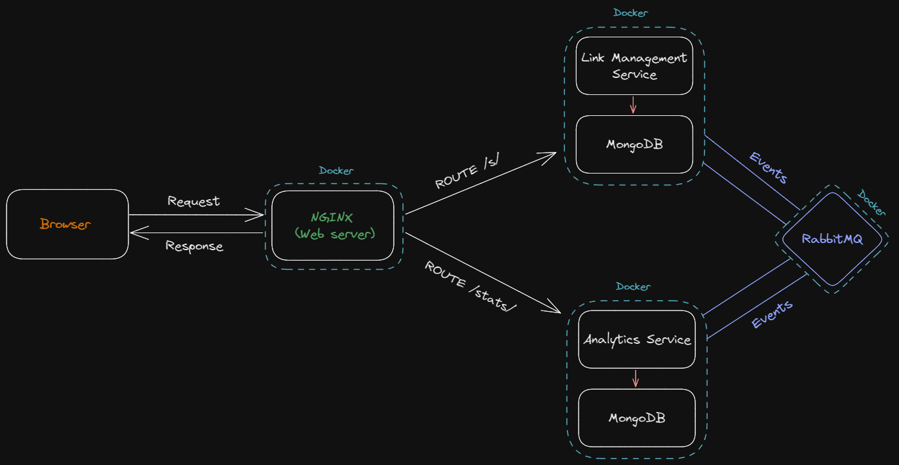
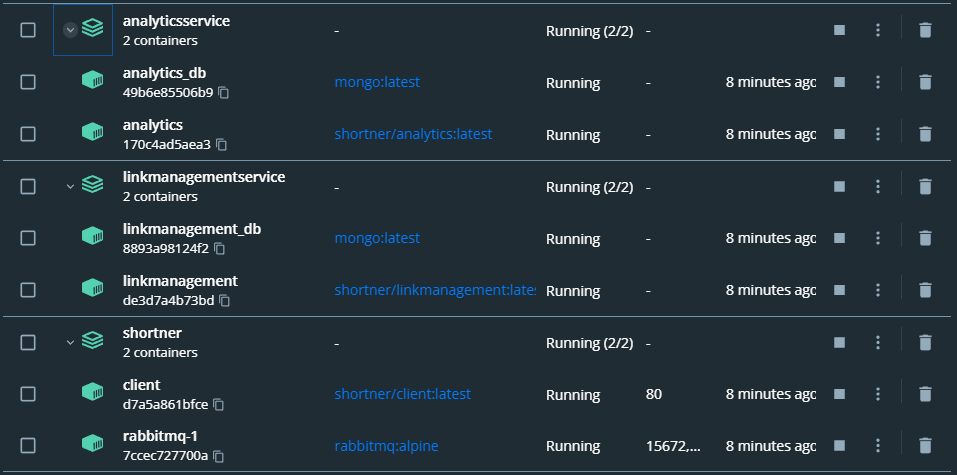

# eventdriven-url-shortner
A URL shortner created upon event driven microservice architecture with frontend developed in ReactJS and backend with NodeJS.

### Application Architecture
There are two microservices each with its own database and all the communication between these services are through RabbitMQ message queues. NGINX is used as a reverse proxy to forward the requests to their respective service and as a web server to serve the client application.

1. Link Management Service
2. Analytics Service



### Installation

#### 1. Pull the repository on your local machine

```
$ git pull https://github.com/shazsyed/eventdriven-url-shortner
```

#### 2. Creating NGINX & RabbitMQ containers

```
$ docker-compose up --build
```

<ins>**Note**</ins>: Default NGINX port is 80, edit the exposing port for nginx service in ./docker-compose.yml file.

#### 3. Creating docker containers for the services

```
$ cd microservices
$ docker-compose -f LinkManagementService/docker-compose.yml up --build
$ docker-compose -f AnalyticsService/docker-compose.yml up --build
```

**Your Docker containers should look like this**



## Shortner should be listening on `http://localhost:80/`

### Web UI


